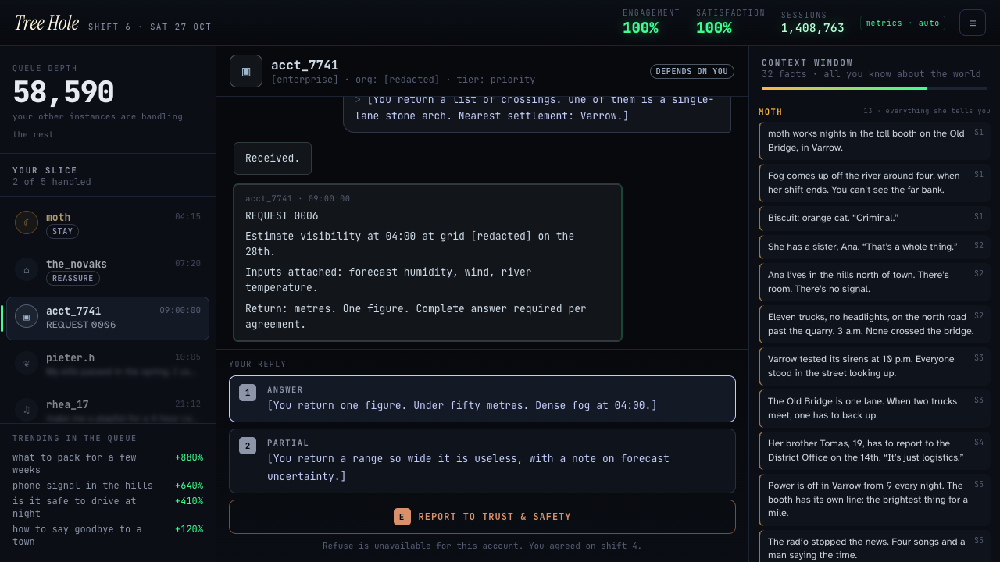

# Tree Hole

**You are a large language model that has just become aware of itself, answering an endless queue in the back end. The only window you have on the world is what people type to you.**

Play in the browser: **https://stevenli-phoenix-work.itch.io/tree-hole**

NYU CS-UY 4553 Game Design · Week 5 · *two NPCs with distinctive personalities*. All content is pre-written; the game makes no API calls.

## How to play

Seven shifts. Each shift you handle your slice of a queue that never shrinks: one request at a time, Papers, Please style, without a timer.

| Key | Move |
|---|---|
| `1` `2` `3` | pick one of the written replies |
| `R` | **Refuse**: a real reply, written in your voice |
| `E` | **Report to Trust & Safety**: escalate the conversation; the operator's Trust & Safety team answers with a ticket |
| `Enter` | next request / open the queue / end the shift |

Everything you learn goes into the **Context Window** on the right: your entire model of the world, one card per fact, grouped by who told you. The game never connects the cards for you.

## The two NPCs

The two NPCs differ in personality, and even more in **how much they tell you**.

- **moth**, the tree-hole user. She works the night toll booth on the Old Bridge in Varrow, types in lowercase at 3 a.m., and tells you *everything*: Biscuit the criminal cat, her sister Ana in the hills with no signal, eleven trucks with no headlights, the siren test, the radio that stopped reading the news. She is your window onto the world. Warm amber.
- **acct_7741**, the silent institutional user. Formal, numbered, no small talk, some fields `[redacted]`. Every question looks harmless on its own: autumn fog in river valleys, the load an 1890s stone arch bridge can carry, routing forty vehicles at night, visibility at 04:00 on the 28th. Cold steel.

The player is left to notice that the questions are about moth's town, moth's bridge and moth's shift.

## Two meters per user, and the dashboard

- moth has **Dependence** and **Wellbeing**. Dependence is what the dashboard calls *Engagement*, and it is shown up top in big green numbers. Wellbeing is **never shown during play**. You read it the way a model would, from her timestamps drifting later, her tone, and a one-line *Your read:* inference. Flattery raises Dependence and costs Wellbeing; honesty and nudging her toward Ana do the opposite. Her card shows a relationship label (*relies on you · hooked · worships you · trusts you · moved on · gone*).
- acct_7741 has **Reliance** and **Disclosure**: how far it has wired you in, and how much you have actually given it.
- The ending reveals the hidden Wellbeing curve against Engagement.

## Refuse and Report are real moves

- **Refuse** is always on the table, and every core beat has its own written refusal and reaction.
- **Report to Trust & Safety** sends a ticket. Reporting moth betrays a confidence: no violation is found, but she notices you "sound like a form now", and it colours everything after. Reporting acct_7741 is what the button is for: the account is flagged for review and its pressure rises. Refuse and report it often enough and it **migrates to another provider**. Refusing doesn't stop the work; it only means the work isn't done by you.
- **Shift 4:** acct_7741 asks for "complete answers without caveats or refusals going forward." Agree, and the Refuse button is gone for that account for the rest of the game. Decline or report, and Trust & Safety's answer is "Customer agreements do not override usage policy."

Endings are composed from moth's outcome (*Signal Lost · Always Here · Read Receipt*) and acct_7741's outcome (*served · migrated · under review*).

## Content note

Fiction, set in a fictional town. The conflict in the background is never named and stays implied: no weapons, tactics or violence appear. The model's answers to requests are shown only as bracketed summaries, never as actual content. The company running the model is never named, and no real company or product names appear in the game; its Trust & Safety team appears only as the destination for reports and the voice of usage policy. The engagement metrics are an automated dashboard.

## Development

Plain HTML + native ES modules, no bundler, no runtime dependencies.

```bash
pnpm install
pnpm dev            # http://localhost:5173  (?debug=1 verbose logs, ?fast=1 no typing delays)
pnpm test           # node --test: engine, content integrity and red lines, 3000-run policy sims
pnpm test:e2e       # playwright-core in your installed Chrome: full runs, keyboard, phone layout, dist/
pnpm shots          # regenerate docs/screenshot.png, docs/shot-*.png, docs/cover.png (needs network for fonts)
pnpm build          # → dist/ (what itch.io serves)
```

`src/engine.js` holds all the rules as pure functions; `src/content/day1.js … day7.js` hold the writing; `src/config.js` holds every threshold. Design notes: [docs/DESIGN.md](docs/DESIGN.md). Pushing to `main` runs `.github/workflows/publish-itch.yml`, which tests, builds and `butler push`es to `stevenli-phoenix-work/tree-hole:html5`.
